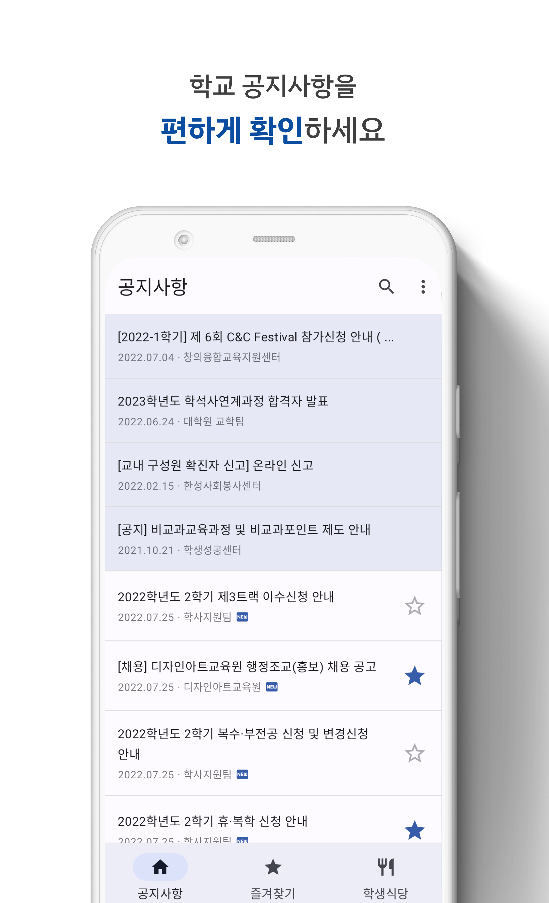
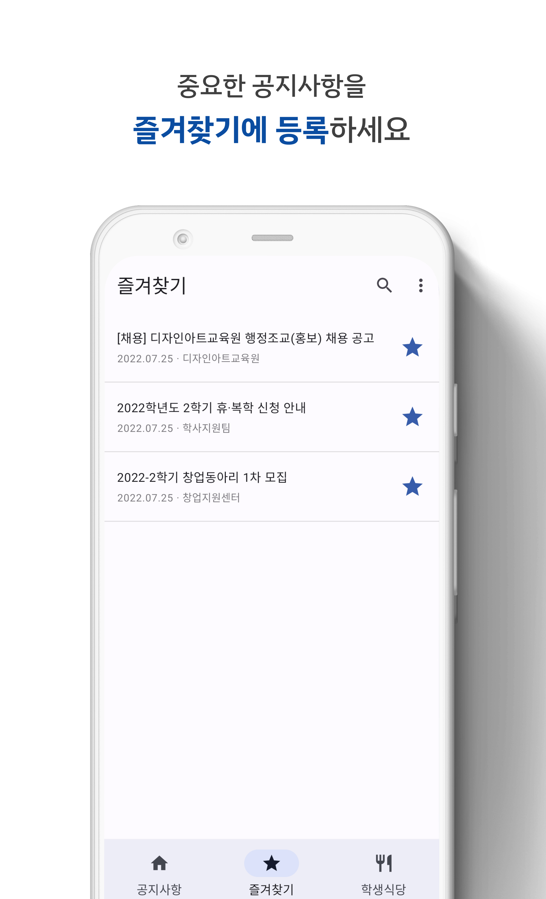
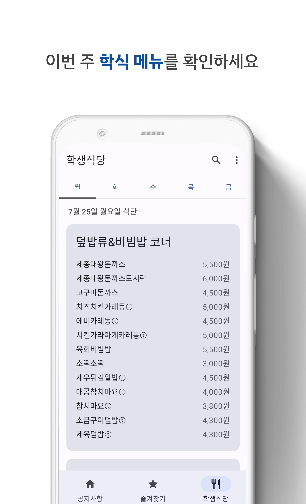
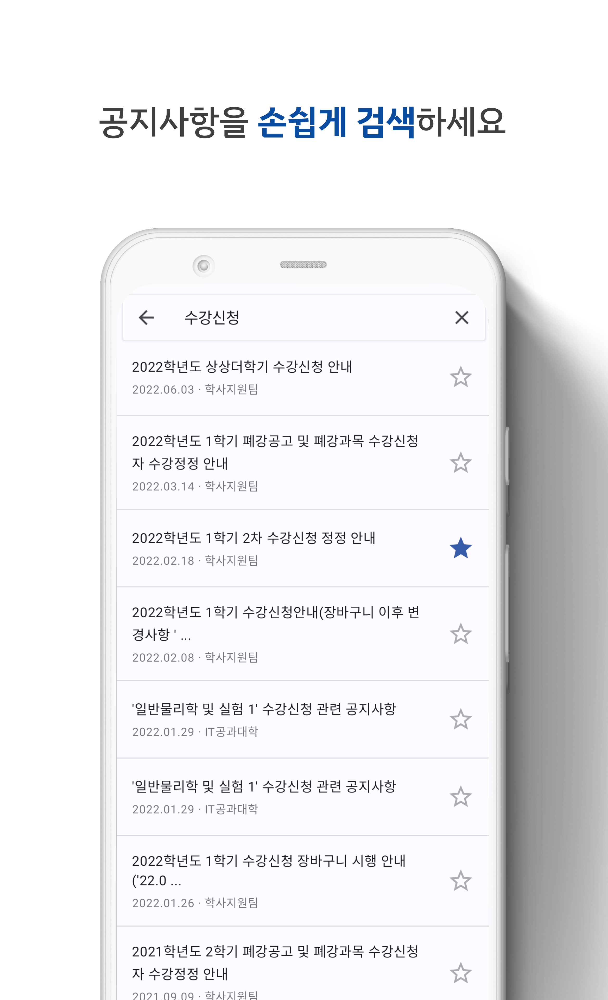
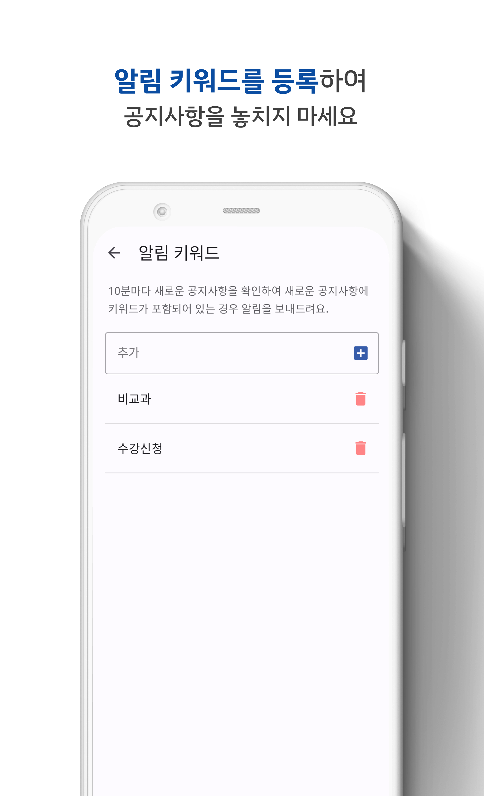
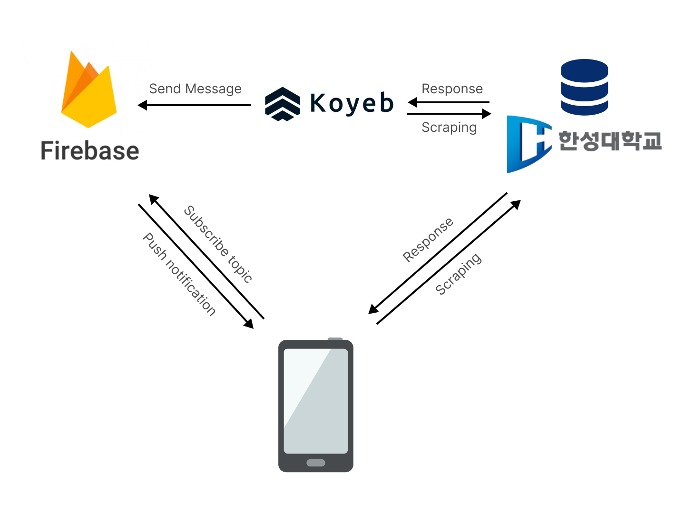
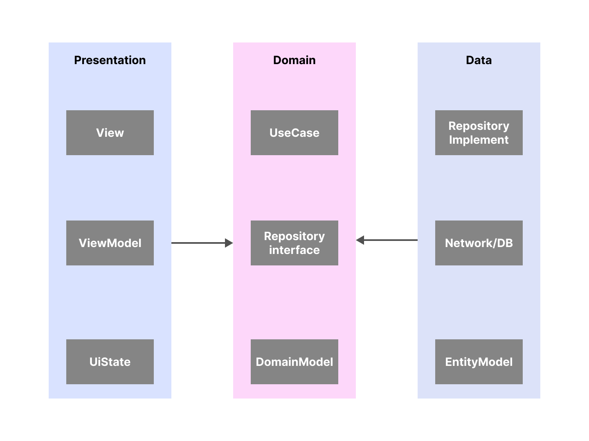

# 한성대 공지

한성대 공지사항을 편하게 보기 위한 어플입니다. 키워드 알림, 즐겨찾기, 검색 기능을 가지고 있습니다.

# 스크린샷

|공지사항|즐겨찾기|학생식당|
|------|---|------|
||||

|검색|알림 키워드|
|------|---|
|||

# 시스템 구조도

# 아키텍쳐

# 기술

- Clean architecture
- MVVM
- Hilt
- Paging
- Compose
- Room
- Retrofit
- Flow
- Coroutine
- Firebase(messaging, realtime-database, auth)
- Espresso

# 키워드 알림

[위키 페이지](https://github.com/jja08111/HansungNotification/wiki/키워드-알림)에서 확인할 수 있습니다.

# 한성대 웹 사이트 리뉴얼시 대응 방법

[위키 페이지](https://github.com/jja08111/HansungNotification/wiki/한성대-웹-사이트-리뉴얼-대응)에서 확인할 수 있습니다.

# Thanks to

이 프로젝트는 [아냥이](https://github.com/juhwankim-dev/pushNotificationApp) 구조를 참고하여 제작되었습니다.
[Juhwan Kim](https://github.com/juhwankim-dev)님께 감사드립니다.
